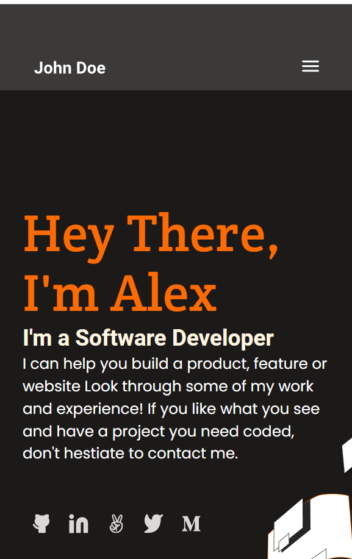
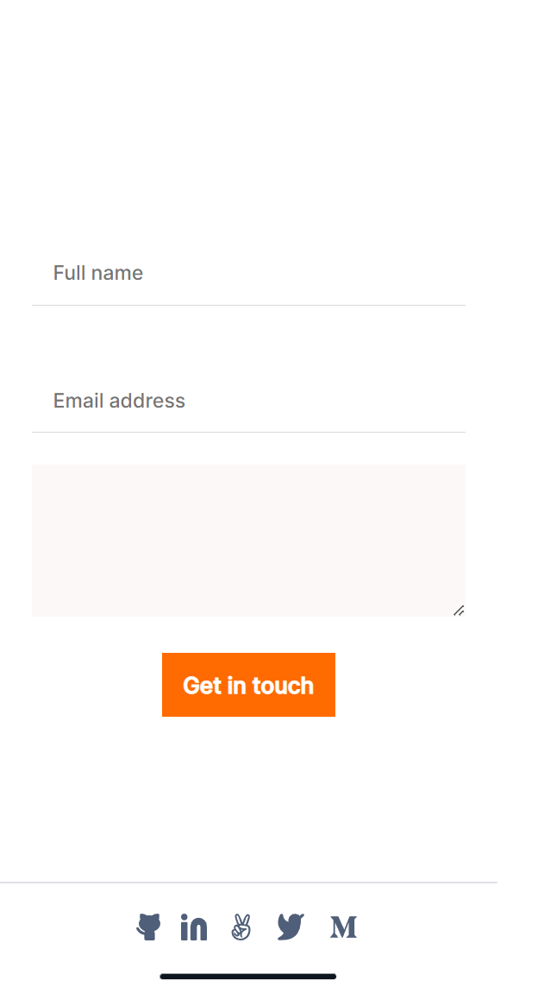

 <h3><b>New Portfolio</b>
 </h5>

<h3><b>Project's Mobile View</b></h3>

# 📗 Table of Contents

- [📖 About the Project](#about-project)
  - [🛠 Built With](#built-with)
    - [Tech Stack](#tech-stack)
    - [Key Features](#key-features)
  - [🚀 Live Demo](#live-demo)
- [💻 Getting Started](#getting-started)
  - [Setup](#setup)
  - [Prerequisites](#prerequisites)
  - [Install](#install)
  - [Usage](#usage)
  - [Run tests](#run-tests)
  - [Deployment](#triangular_flag_on_post-deployment)
- [👥 Authors](#authors)
- [🔭 Future Features](#future-features)
- [🤝 Contributing](#contributing)
- [⭐️ Show your support](#support)
- [🙏 Acknowledgements](#acknowledgements)
- [❓ FAQ (OPTIONAL)](#faq)
- [📝 License](#license)

# 📖 The Portfolio 

**The Portfolio** is my portfolio website that is made as a part of Microverse's task.

(<a href="#readme-top">back to top</a>)

## 💻 Getting Started 

git clone url
### Prerequisites

In order to run this project you need:

Browser
git 
code editor
simple html, css, npm, and linter you need to know.

### Setup

Clone this repository to your desired folder:
cd my-folder
git clone https://github.com/SAZZAD1Q2/portfolio.git

### Usage

To run the project, execute the following command:

git clone
cd The portfolio
code .
npm install

### Run tests

To run tests, run the following commands:

### Deployment

This is the online version of my app 
https://sazzad1q2.github.io/New-Portfolio/

(<a href="#readme-top">back to top</a>)

## 👥 Authors 

👤 **Sazzad Hossain**

- GitHub: [@githubhandle](https://github.com/SAZZAD1Q2)
- Twitter: [@twitterhandle](https://twitter.com/SazzadShaikh11)
- LinkedIn: [LinkedIn](https://www.linkedin.com/in/sazzad-hossain-054720257)

👤 **Seyi Oyemade**

- GitHub: [@githubhandle](https://github.com/seyioyemade)

(<a href="#readme-top">back to top</a>)

## 🔭 Future Features 

- Details modal
- Validate contact form
- Preserve data in the browser

(<a href="#readme-top">back to top</a>)

## 🤠Contributing 

Contributions, issues, and feature requests are welcome!

Feel free to check the [issues page](../../issues/).

(<a href="#readme-top">back to top</a>)

## ⭐️ Show your support 

(<a href="#readme-top">back to top</a>)

<!-- ACKNOWLEDGEMENTS -->

## 🙠Acknowledgments 

> Give credit to everyone who inspired your codebase.

I would like to thank... Microverse as got the chanch to use their template.

Also thanks to my collaborator for helping me so much.

(<a href="#readme-top">back to top</a>)

<!-- LICENSE -->

## 📠License 

This project is [MIT](./LICENSE) licensed.

(<a href="#readme-top">back to top</a>)

